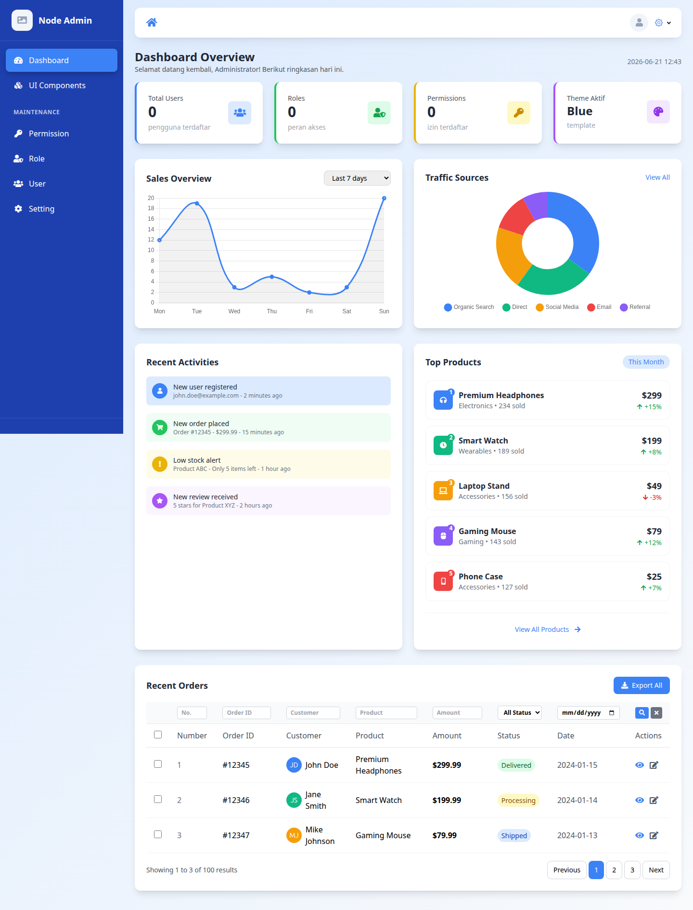
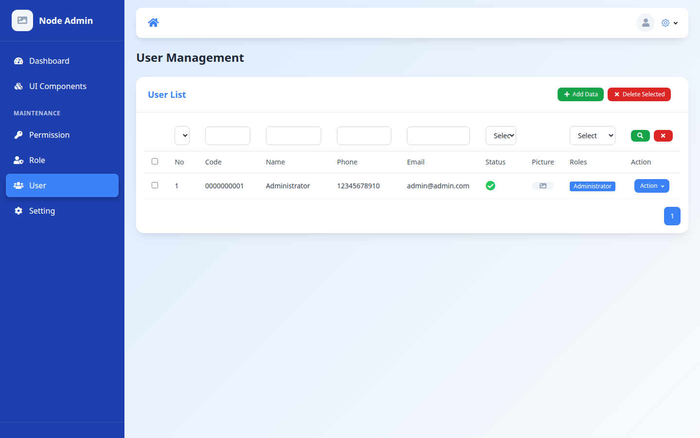
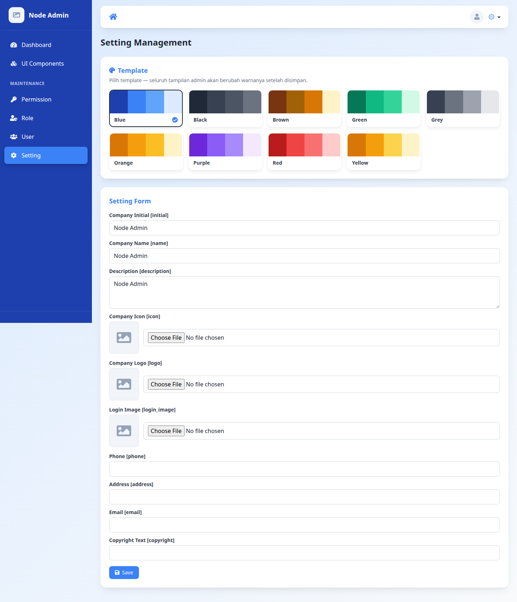
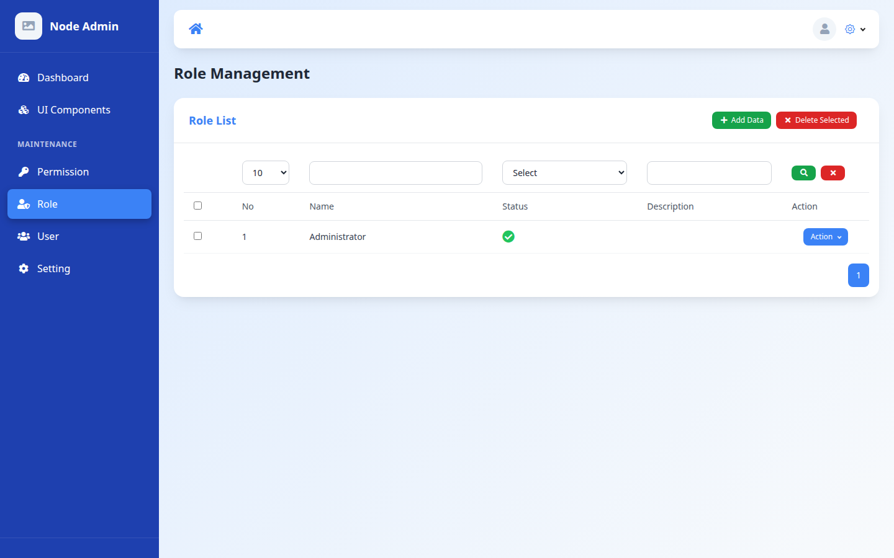
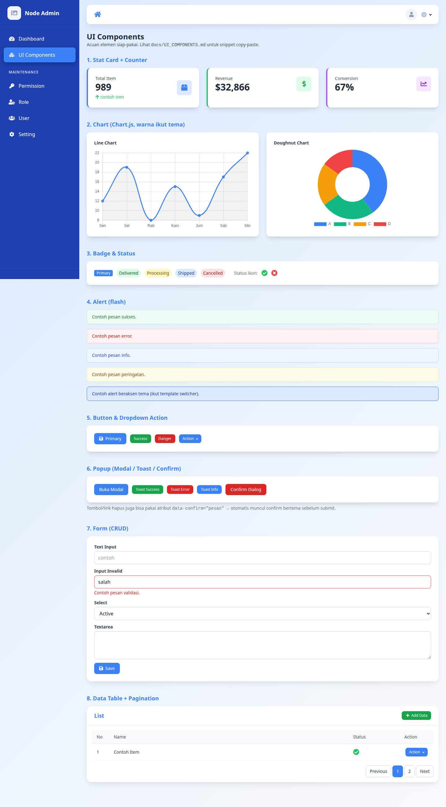

# Node Admin

Node Admin adalah **starter pack / bootstrap** untuk membangun aplikasi admin panel berbasis Node.js (TypeScript + Express + TypeORM). Dirancang sebagai fondasi yang scalable dengan menerapkan prinsip rekayasa perangkat lunak yang solid, keamanan berlapis, dan suite pengujian lengkap.

Runtime generik & tooling diekstrak ke **paket terbitan** (`@flazhost-nodeadmin/*`) sehingga app turunan dapat menarik update via versi tanpa menyalin ulang kode. Lihat [Paket Pabrik](#-paket-pabrik).

---

## ⚡ Buat Aplikasi Baru (Scaffold)

Cara tercepat — satu perintah menghasilkan aplikasi NodeAdmin utuh di folder tujuan:

```bash
npm create @flazhost-nodeadmin/app myapp
cd myapp
npm install
cp .env.example .env          # default: SQLite (tanpa server DB)
npm run migration:run         # buat tabel + seed admin & setting
npm run start:dev             # http://localhost:3000
```

Login default: `admin@admin.com` / `12345678`. Aplikasi hasil scaffold adalah project **standalone** yang menarik runtime dari `@flazhost-nodeadmin/core` + `cli` (npm) — update cukup `npm update`. Lihat [`@flazhost-nodeadmin/create-app`](https://www.npmjs.com/package/@flazhost-nodeadmin/create-app).

> Perbedaan penting: `npm install @flazhost-nodeadmin/core` hanya memasang **library** ke `node_modules/` (untuk dipakai app yang sudah ada). Untuk **men-scaffold aplikasi utuh** ke folder kosong, pakai `npm create @flazhost-nodeadmin/app`.

---

## 📦 Paket Pabrik

Bagian generik dipublikasikan ke npm sebagai paket berversi (changesets). App turunan meng-`install`-nya, bukan menyalin file.

| Paket | Fungsi |
|-------|--------|
| [`@flazhost-nodeadmin/core`](https://www.npmjs.com/package/@flazhost-nodeadmin/core) | Runtime generik: DI/container, `AppError` + error handling, `renderView`, helpers (`paginate`, `ciLike`), `namedRoutes`/`handler`, themes, csrf, rate limiter, `createApp`, `createDataSource`. |
| [`@flazhost-nodeadmin/cli`](https://www.npmjs.com/package/@flazhost-nodeadmin/cli) | Tooling: `nodeadmin check` (convention checker / CI gate), `nodeadmin make-migration`, `nodeadmin copy-views`. |
| [`@flazhost-nodeadmin/create-app`](https://www.npmjs.com/package/@flazhost-nodeadmin/create-app) | Scaffolder: `npm create @flazhost-nodeadmin/app myapp` → aplikasi utuh ter-generate (template ditarik dari GitHub via giget). |

```bash
npm install @flazhost-nodeadmin/core
npm install -D @flazhost-nodeadmin/cli
```

```ts
import { createApp, AppError, renderView, handler } from '@flazhost-nodeadmin/core'
```

Repo ini sendiri adalah **monorepo** (npm workspaces): app referensi di `src/`, paket terbitan di `packages/`. Rilis dikelola via [changesets](https://github.com/changesets/changesets) (`npx changeset` → `version` → `publish`).

---

## 🖼️ Tampilan

| Login | Dashboard |
|-------|-----------|
|  |  |

| User Management (RBAC) | Setting + Template Switcher (9 tema) |
|------------------------|--------------------------------------|
|  |  |

| Role & Permission | UI Components |
|-------------------|---------------|
|  |  |

---

## ✨ Fitur

- **User Management** — CRUD pengguna, multi-role, foto profil.
- **Role & Permission (RBAC)** — kontrol akses berbasis route + permission per-aksi.
- **Profile Management** — pengguna mengelola profil & password sendiri.
- **Authentication** — sesi (Passport local + Redis) untuk web & **JWT** untuk API.
- **Password Reset** — OTP via email (hashed + expiry).
- **Template Switcher** — 9 tema warna (Blue, Black, Brown, Green, Grey, Orange, Purple, Red, Yellow) yang dapat diganti dari halaman Setting; seluruh UI admin berubah tanpa rebuild.
- **Frontend Template Switcher** — halaman landing publik (`/`) dengan ~15 desain pilihan dari [opentailwind](https://github.com/lindoai/opentailwind) (MIT). Template di-unduh on-demand saat dipilih di Setting & di-cache lokal — app tetap ramping (hanya 1 default ter-bundle).
- **Multi-Database** — dialect-agnostic via TypeORM (MySQL, MariaDB, PostgreSQL, SQLite, MSSQL, Oracle) cukup dengan mengganti `DB_TYPE`.
- **Multi-Timezone** — tampilan tanggal mengikuti timezone pengguna (dayjs).
- **File Storage** — upload ke Alibaba Cloud OSS (re-encode gambar via sharp).
- **Stateless** — session di Redis, file di OSS → siap horizontal scaling.

---

## 🏗️ Arsitektur & Prinsip

Aplikasi disusun **modular per fitur** (`src/modules/<modul>`), tiap modul punya lapisan: `routes → middleware → controller → service → entity → views`.

Prinsip yang diterapkan (detail di [`docs/ARCHITECTURE.md`](docs/ARCHITECTURE.md)):

| Prinsip | Penerapan |
|---------|-----------|
| **SOLID** | Dependency Injection via [tsyringe](https://github.com/microsoft/tsyringe) — controller & service di-inject lewat container (`src/container.ts`), service mengimplementasikan interface (`I*Service`). |
| **DRY** | Helper terpusat: `paginate()`, `ciLike()`, `renderView()`, `removeEmptyFields()`. |
| **Separation of Concerns** | Controller (HTTP) ≠ Service (bisnis) ≠ Repository (data) ≠ View (presentasi). |
| **Clean Code** | Error handling terpusat (`AppError` + `errorHandler` middleware); service `throw`, bukan `return error`. |
| **Low Coupling** | Komponen bergantung pada abstraksi (interface + token DI), bukan implementasi konkret. |
| **Twelve-Factor** | Config via env terpusat & tervalidasi (`src/config/env.ts`), stateless, logs ke stdout, graceful shutdown. |
| **TDD / BDD** | Suite test menyeluruh (lihat bagian Testing). |

---

## 📁 Struktur Direktori

```
packages/                # paket terbitan (npm workspaces)
├── core/                # @flazhost-nodeadmin/core — runtime generik (dist dari src TS)
└── cli/                 # @flazhost-nodeadmin/cli  — tooling (nodeadmin check|make-migration|copy-views)

src/                     # app referensi (mengonsumsi @flazhost-nodeadmin/core)
├── config/          # env (terpusat & tervalidasi), ormconfig, app
├── container.ts     # registrasi DI (tsyringe)
├── tokens.ts        # token DI
├── services/        # fileService (OSS), mailer, settingCache
├── resources/       # layout & partial EJS (be/tw = tema Tailwind aktif)
└── modules/
    ├── access/      # user, role, permission (RBAC)
    ├── auth/        # login, register, JWT, reset password
    ├── components/  # showcase komponen UI
    ├── dashboard/
    ├── profile/
    └── setting/     # setting + template switcher
tests/               # unit, integration, api, security, smoke, e2e, bdd
docs/                # ARCHITECTURE.md, TESTING.md, API.md
.changeset/          # entri rilis (changesets)
```

---

## 🚀 Instalasi

```bash
git clone https://github.com/NodeJsTech-Id/NodeAdmin.git
cd NodeAdmin
npm install
```

### 1. Siapkan database

Default MySQL — buat database kosong:
```sql
CREATE DATABASE nodeadmin;
```
(Untuk DB lain, lihat bagian **Multi-Database** di bawah.)

### 2. Konfigurasi `.env`

Salin `.env.example` ke `.env`, lalu isi. **Wajib** di production: `SESSION_SECRET` & `JWT_SECRET` (app berhenti jika kosong saat `NODE_ENV=production`).

```bash
cp .env.example .env
# generate secret:
node -e "console.log(require('crypto').randomBytes(32).toString('hex'))"
```

Variabel penting:
```
APP_PORT=3000
NODE_ENV=development

DB_TYPE=mysql            # mysql | mariadb | postgres | sqlite | mssql | oracle
DB_HOST=localhost
DB_PORT=3306
DB_USERNAME=root
DB_PASSWORD=
DB_DATABASE=nodeadmin

REDIS_URL=redis://127.0.0.1:6379

SESSION_SECRET=          # WAJIB di production
JWT_SECRET=              # WAJIB di production
JWT_EXPIRES_IN=1h
BCRYPT_ROUNDS=10
OTP_EXPIRY_MINUTES=10

# Alibaba OSS (penyimpanan file)
OSS_ACCESS_ID=
OSS_ACCESS_KEY=
OSS_ENDPOINT=oss-ap-southeast-5.aliyuncs.com
OSS_BUCKET=
OSS_SSL=true
```

### 3. Migrasi + seed

```bash
npm run migration:run
```
Membuat skema + seed admin default & data setting awal.

### 4. Jalankan

```bash
npm run start:dev      # mode dev (nodemon + ts-node)
# atau
npm start              # mode produksi (build + pm2 dari dist)
```

Buka **http://localhost:3000**. Login default:
```
Email   : admin@admin.com
Password: 12345678
```
> ⚠️ Ganti password admin sebelum production.

---

## 🗄️ Multi-Database

Aplikasi dialect-agnostic. Ganti `DB_TYPE` + install driver yang sesuai:

| DB | DB_TYPE | Driver |
|----|---------|--------|
| MySQL | `mysql` | `mysql2` (terpasang) |
| MariaDB | `mariadb` | `mysql2` |
| PostgreSQL | `postgres` | `pg` (terpasang) |
| SQLite | `better-sqlite3` | `better-sqlite3` (dev) |
| SQL Server | `mssql` | `mssql` |
| Oracle | `oracle` | `oracledb` |

SQLite: isi `DB_DATABASE` dengan path file (mis. `./dev.sqlite`). Lalu `npm run migration:run`.

---

## 🎨 Template Switcher

Login → menu **Setting** → pilih salah satu dari 9 swatch warna → **Save**. Seluruh UI admin & halaman login berganti warna seketika (disimpan di `settings.theme`, dibaca lewat CSS variable). Palet didefinisikan di `src/config/themes.ts`.

---

## 🔒 Keamanan

- **Helmet** — security headers (HSTS, X-Frame-Options, nosniff).
- **CSRF protection** — token sinkron untuk semua form web (`src/middleware/csrf.ts`).
- **Rate limiting** — login / register / OTP dibatasi per-IP.
- **Session cookie** — `httpOnly`, `sameSite`, `secure` (otomatis di production).
- **Password** — bcrypt; OTP reset di-hash + expiry + rate-limit.
- **JWT** — algoritma di-pin (HS256), blacklist saat logout (TTL).
- **RBAC** — `ensureAuthenticated` → `AccessMiddleware` di setiap route admin.
- **Mass-assignment guard** — Joi `stripUnknown` pada input.
- **Validasi upload** — magic-byte (sharp), whitelist ekstensi.
- **Secrets** — fail-fast jika `SESSION_SECRET`/`JWT_SECRET` kosong di production.

---

## 🧪 Testing

Suite lengkap — detail di [`docs/TESTING.md`](docs/TESTING.md).

| Perintah | Cakupan |
|----------|---------|
| `npm test` | Semua Jest (unit + integration + api + security + smoke) |
| `npm run test:unit` | Helper murni |
| `npm run test:integration` | Service ↔ DB (SQLite in-memory) |
| `npm run test:api` | Endpoint via supertest |
| `npm run test:security` | RBAC, CSRF, rate-limit, JWT, mass-assign |
| `npm run test:smoke` | Health, login, DB connect |
| `npm run test:coverage` | Jest + laporan coverage |
| `npm run test:e2e` | Playwright (browser, 3 engine) |
| `npm run test:bdd` | Cucumber (skenario Gherkin) |

CI (GitHub Actions, `.github/workflows/ci.yml`): typecheck + Jest + audit + matrix DB (MySQL/Postgres) + Playwright tiap push/PR.

---

## 🔌 API

Endpoint REST `/api/v1/*` (auth via JWT Bearer). Daftar lengkap + contoh request/response di [`docs/API.md`](docs/API.md).

Ringkas:
- `POST /api/v1/auth/login` → dapatkan `access_token`
- `/api/v1/access/user|role|permission` → CRUD (butuh `Authorization: Bearer <token>`)
- `/api/v1/profile` → profil sendiri

---

## 📜 Scripts

```
npm run build            # compile TS + copy views ke dist
npm run start:dev        # dev (nodemon + ts-node)
npm start                # build + pm2
npm run migration:run    # jalankan migrasi
npm run migration:revert # rollback migrasi terakhir
npm run migration:create # buat file migrasi baru
npm test / test:*        # lihat bagian Testing

# Paket pabrik (packages/*)
npm run build:core       # compile @flazhost-nodeadmin/core ke dist
npx changeset            # catat perubahan rilis
npx changeset version    # bump versi + tulis CHANGELOG
npx changeset publish    # publish ke npm + buat git tag
```

---

## 🧩 Tech Stack

TypeScript · Express · TypeORM · MySQL/PostgreSQL/dll · Redis (session) · EJS + Tailwind · tsyringe (DI) · Passport (local + JWT) · Joi · Jest + supertest · Playwright · Cucumber · Alibaba OSS · Helmet.

---

## License

The Node Admin is open-sourced software licensed under the [MIT license](https://opensource.org/licenses/MIT).
